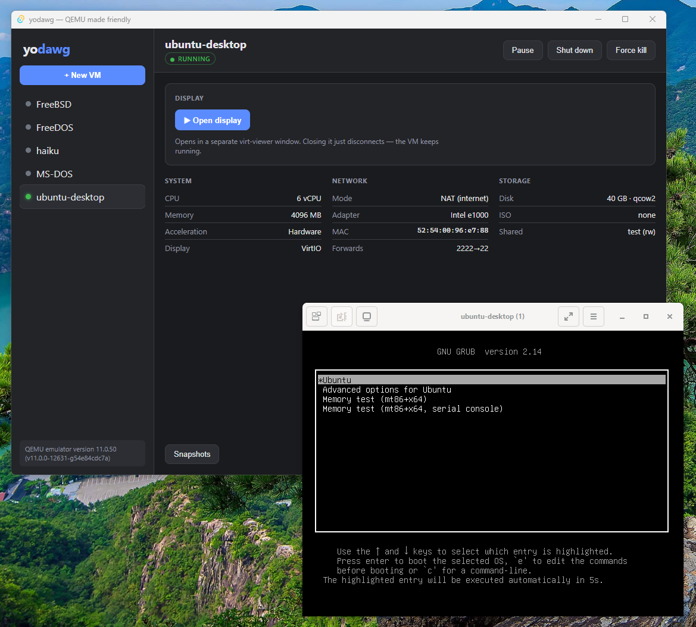

# yodawg

A friendly, cross-platform GUI for [QEMU](https://www.qemu.org/) — a VirtualBox-like
experience with QEMU/KVM performance underneath.

QEMU is fast and powerful but its command line is intimidating and there's no
great desktop UI for it. yodawg wraps QEMU so normal people can create, run, and
manage virtual machines without touching a flag, while still getting native
hardware acceleration (WHPX on Windows, and KVM/HVF later).



> Status: **v0.2.13**. Primary target today is **Windows native** (WHPX).
> Working codename, subject to change.

## Features

- **Create-VM wizard** — pick an ISO, set RAM / CPU / disk size, choose a
  display and network adapter, and it creates the `qcow2` disk and boots.
- **VM list** with live running / paused / stopped status.
- **Display via virt-viewer (SPICE)** — each VM runs a SPICE server, and its
  display opens in the [virt-viewer](https://virt-manager.org/) client —
  automatically when you start a VM, or via the **Open display** button. That
  gets you clipboard sharing, dynamic display resize, and USB redirection out of
  the box. Pick the **QXL** or **VirtIO** display adapter for the best
  experience; the guest needs `spice-vdagent` for clipboard/auto-resize.
  virt-viewer is bundled with the Windows installer.
- **Lifecycle controls** — start, graceful ACPI shutdown, pause / resume, force
  kill (disk writes are flushed first so nothing is lost), and delete.
- **Snapshots** — save and restore full VM state. Snapshots can be taken live on
  a running guest where QEMU supports it.
- **Networking** — pick a mode (**NAT** with internet access, **Isolated** —
  the guest gets a DHCP lease but can't reach the host or internet, or **None**),
  set up host→guest **port forwarding**, and choose the NIC model (Intel e1000,
  VirtIO, RTL8139, NE2000 for DOS). Each VM keeps a **stable MAC** so DHCP leases
  and MAC-bound licenses survive reboots.
- **Shared folder** — share a host folder into the guest as a virtual FAT disk
  (QEMU vvfat) to move files in without networking. Read-only by default; an
  optional (experimental) writable mode lets the guest write back. See
  [Moving files in and out of a VM](#moving-files-in-and-out-of-a-vm).
- **Edit settings** — change RAM, CPUs, display/network adapter, networking mode,
  port forwards, the shared folder, and the attached ISO of a stopped VM; eject
  the ISO.
- **Just works defaults** — acceleration and a safe CPU model are auto-selected
  per platform; absolute-pointer mouse (USB tablet) so the cursor tracks 1:1;
  disk-first boot order so installed systems boot themselves.
- **Pause on exit, resume on reopen** — closing the window suspends running
  guests (they keep their state in the background); reopening yodawg reattaches
  to them so you can pick up where you left off.

## Requirements

To **run** the app:

- Windows 10/11 with the **Windows Hypervisor Platform** feature enabled
  (for WHPX acceleration), and the **WebView2** runtime (preinstalled on current Windows).
- **QEMU for Windows** installed (default lookup: `C:\Program Files\qemu`). Set the
  `YODAWG_QEMU_DIR` environment variable to point at a custom install.

To **build** it:

- [Rust](https://rustup.rs/) (MSVC toolchain) + the Visual Studio C++ build tools
- [Node.js](https://nodejs.org/) 18+
- The Tauri prerequisites for your OS: https://tauri.app/start/prerequisites/

## Development

```bash
npm install            # install frontend deps
npm run tauri dev      # run the app with hot reload
npm run tauri build    # produce a release bundle
```

Useful sub-commands:

```bash
npm run build                       # typecheck + bundle the frontend only
cargo check --manifest-path src-tauri/Cargo.toml   # check the Rust backend
```

> **Building from WSL?** The toolchain must run against the Windows filesystem
> and Windows binaries. See [CLAUDE.md](./CLAUDE.md) for the interop workflow and
> gotchas.

### Installer (Windows, bundles QEMU)

`npm run tauri build` produces an NSIS installer at
`src-tauri/target/release/bundle/nsis/yodawg_<version>_x64-setup.exe`. It
bundles both the **QEMU** setup and the **virt-viewer** (SPICE client)
installer, and during install checks whether each is already present — running
the bundled installer silently only if it's missing (QEMU at
`C:\Program Files\qemu`; virt-viewer in any `C:\Program Files\VirtViewer*`).
Because the bundled dependencies install into Program Files, the installer is
**per-machine** (requires admin / one UAC prompt).

Before building, drop the two bundled installers into `src-tauri/installer/`
(both gitignored — large — and embedded by the NSIS hook in
`src-tauri/installer/hooks.nsh`):

- `qemu-w64-setup.exe` — the QEMU for Windows setup (~200 MB)
- `virt-viewer.msi` — the virt-viewer MSI (~80 MB), from
  [virt-manager.org/download](https://virt-manager.org/download/)

## How it works

- **Frontend** (`src/`) — React + TypeScript in a Tauri webview. Renders the VM
  list, the create/edit dialogs, and the VM lifecycle controls.
- **Backend** (`src-tauri/src/`) — Rust. Spawns and tracks `qemu-system-x86_64`
  processes, controls them over QMP, and persists VM configs.
  - `qemu.rs` — binary discovery, acceleration/CPU selection, QEMU argument
    building, disk creation, free-port allocation.
  - `qmp.rs` — minimal QEMU Monitor Protocol client (shutdown, pause, status,
    snapshots).
  - `vm.rs` — VM config model and on-disk persistence.
  - `session.rs` — records background VMs so a relaunch can reattach to them.
  - `procutil.rs` — Windows PID liveness/terminate helpers for reattached VMs.
  - `lib.rs` — runtime state and the Tauri commands the frontend calls.

The display is served over **SPICE** (QEMU's `-spice` server on loopback) and
shown by the external **virt-viewer** (`remote-viewer`) client — launched
automatically on start, or via the **Open display** button. There's no
in-window display: SPICE has no maintained web client, so virt-viewer is the
viewer (and you get clipboard, dynamic resize, and USB redirection for free).
Control runs over **QMP** (QEMU Monitor Protocol) on a TCP socket.

### Where VMs live

```
%APPDATA%/com.yodawg.app/
├── running.json              # VMs left running/paused in the background
└── machines/<name>/
    ├── vm.json               # VM config (RAM, CPU, disk, ISO, adapters, port forwards, shared folder, ...)
    ├── disk.qcow2            # virtual disk (also holds snapshots)
    └── qemu.log             # QEMU stdout/stderr from the last launch
```

## Moving files in and out of a VM

Two built-in ways to get files across the host/guest boundary, no extra tools
on the host:

**Shared folder (vvfat).** In the create or edit dialog, pick a **Shared
folder**. On the next start, that host folder appears inside the guest as a
small extra disk formatted FAT:

- **Linux guests:** it shows up as a second disk (e.g. `/dev/sdb1`) — mount it
  with `mount /dev/sdb1 /mnt` (the partition is FAT, type `vfat`).
- **Windows guests:** it auto-assigns a new drive letter.
- **DOS guests:** it's an extra drive letter (e.g. `D:`).

Anything you drop in the host folder shows up in the guest. It's **read-only by
default** — solid and safe for copying files *in*. Ticking **Allow the guest to
write back** enables vvfat's read-write mode so the guest can save files back to
the host folder, but that mode is fragile and **can corrupt the folder's
contents** under heavy or concurrent writes, so treat it as experimental and
don't point it at anything irreplaceable. Changes to the shared-folder setting
take effect the next time the VM starts.

> vvfat presents a *snapshot* of the folder taken at boot. If you add files to
> the host folder while the guest is already running, restart the guest (or
> remount the drive inside it) to see them.

**Port forwarding.** For a robust two-way channel — especially for large files —
add a host→guest **port forward** under Networking and run a server in the
guest: e.g. an SSH/SFTP server (then `scp` to `127.0.0.1:<hostPort>` from the
host) or a quick `python3 -m http.server` to pull files over a browser. This
needs the guest online (NAT or Isolated mode — port forwards work in both).

## Troubleshooting

### FreeDOS (or other DOS) won't boot after removing the install CD

The VM boots disk-first with CD-ROM fallback. If a DOS guest only boots while
the install ISO is attached and fails ("no bootable device" / "Invalid partition
table") once you detach it, the installer never wrote boot code to the disk's
**master boot record** — so the BIOS skips the disk and was really booting from
the CD all along, which then chained into the disk.

Fix it from inside the guest, one time:

1. Boot **with the ISO still attached** to reach a DOS prompt.
2. Run:
   ```
   FDISK /MBR     REM write standard MBR boot code to the first hard disk
   SYS C:         REM (re)install the boot sector + kernel on C:
   ```
   In `FDISK`, also confirm partition 1 is set **Active** (option 2).
3. Shut down, **Detach ISO**, and boot — it should now boot standalone to `C:`.

### Mouse drifts or won't reach the screen edges (DOS, Windows 3.1)

Older guests with only a relative pointing device can drift when the display is
scaled. In virt-viewer, set **View → Zoom → Normal (100%)** so the image renders
at native scale and pointer motion maps cleanly. (Modern guests use the absolute
USB tablet yodawg adds, so they track fine at any zoom.)

### virt-viewer won't auto-resize the guest (esp. GNOME / Wayland)

Auto-resize needs the guest's `spice-vdagent` installed, and **View →
Automatically resize** checked in the virt-viewer window.

**On a Linux/GNOME (Wayland) guest, use the VirtIO display adapter.** virtio-gpu
follows the virt-viewer window size reliably across reboots. **QXL** tends to
*fit once on login, then ignore resizes* — the GNOME compositor saves the
auto-negotiated layout to `~/.config/monitors.xml` and treats it as a pinned
resolution on the next login, so it stops following the SPICE hint. Switching
the VM to VirtIO (Edit → Display adapter → VirtIO, then restart) is the clean
fix.

If you need to stay on QXL, stop GNOME from re-pinning by making that file
un-writable, inside the guest (one-time, survives reboots):

```bash
rm -f ~/.config/monitors.xml ~/.config/monitors.xml~
: > ~/.config/monitors.xml          # empty = "no saved layout" → auto
chattr +i ~/.config/monitors.xml    # immutable: GNOME can't re-pin it
# then log out and back in   (undo later with: chattr -i ~/.config/monitors.xml)
```

## Roadmap

- More networking beyond the current NAT / Isolated / port-forwarding: bridged
  or host-only (guest on the physical LAN — needs a TAP driver + admin on
  Windows) and VM-to-VM internal networks
- macOS (HVF) and Linux (KVM) support
- Disk resize, VM cloning, OVA/OVF import/export

## License

[MIT](LICENSE) © Jeff Aigner
</content>
</invoke>
